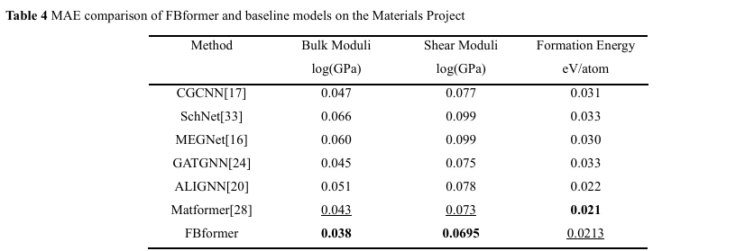
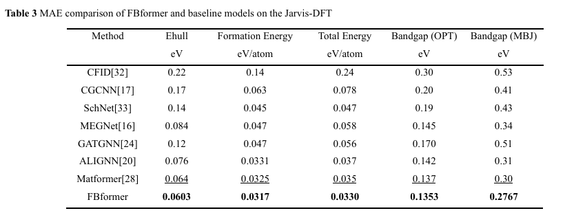

# FBformer: A Four-Body Feature Enhanced Periodic Graph Transformer for Crystal Property Prediction

## Dataset

### The Materials Project Dataset
We provide benchmark results for previous works, including CGCNN, SchNet, MEGNET, GATGNN, ALIGNN, Matformer on The Materials Project Dataset.

In particular, for tasks of formation energy and band gap, we directly follow ALIGNN and use the same training, validation, and test set, including 60000, 5000, and 4239 crystals, respectively. For tasks of Bulk Moduli and Shear Moduli, we follow GATGNN, the recent state-of-the-art method for these two tasks, and use the same training, validation, and test sets, including 4664, 393, and 393 crystals. In Shear Moduli, one validation sample is removed because of the negative GPa value. We either directly use the publicly available codes from the authors, or re-implement models based on their official codes and configurations to produce the results.

For bulk and shear datasets, we used the datasets at https://figshare.com/projects/Bulk_and_shear_datasets/165430

### JARVIS dataset

We also provide benchmark results for previous works, including CGCNN, SchNet, MEGNET, GATGNN, ALIGNN, Matformer on JARVIS Dataset.

JARVIS is a newly released database proposed by Choudhary et al.. For JARVIS dataset, we follow ALIGNN and use the same training, validation, and test set. We evaluate our FBformer on five important crystal property tasks, including formation energy, bandgap(OPT), bandgap(MBJ), total energy, and Ehull. The training, validation, and test set contains 44578, 5572, and 5572 crystals for tasks of formation energy, total energy, and bandgap(OPT). The numbers are 44296, 5537, 5537 for Ehull, and 14537, 1817, 1817 for bandgap(MBJ). The used metric is test MAE. The results for CGCNN and CFID are taken from ALIGNN, other baseline results are obtained by retrained models. 

## Benchmarked results

### The Materials Project Dataset


### JARVIS dataset


## Training and Prediction

You can train and test the model with the following commands:

```bash
conda create --name FBformer python=3.10
conda activate FBformer
conda install pytorch torchvision torchaudio pytorch-cuda=11.6 -c pytorch -c nvidia
conda install pyg -c pyg
pip install jarvis-tools==2022.9.16
python setup.py
# Training FBformer for the Materials Project
cd FBformer
python train_mp.py
# Training FBformer for JARVIS
cd matformer
python train_js.py
```

when using the above scripts, please remember to adjust the properties you want to train in train.py, and also add mp_id_list="shear" or "bulk" if you want to train the model for shear or bulk moduli.

